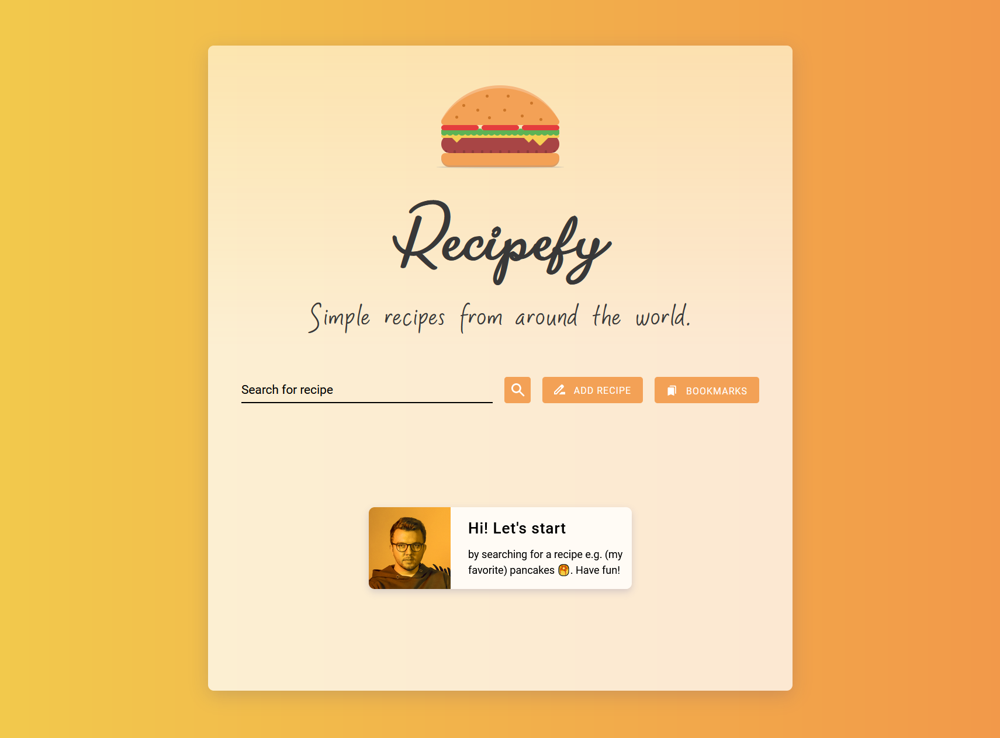

<h1 align="left">
  RECIPEFY
</h1>

<h2 align="left">
  Simple Cook Book site
</h2>

<h2 align="left">
 by Łukasz Podlipski
</h2>
<br/><br/>
<p align="left">
 
</p>

<br/><br/>
<h3 align="left">
 You can...
</h3>

> Search for your favorite pancakes recipe 🥞
<p align="left">
 
</p>
<br/><br/>

> Add your own recipe 👩‍🍳

<p align="left">
 
</p>
<p align="left" style="margin:10px 0 0 0;">
 
</p>
<br/><br/>

>Bookmark your favorite recipies 📚

<p align="left">
 
</p>
<br/><br/>

>Bookmarks are always available in your browser local storage 💾

<p align="left">
 
</p>
<br/><br/>
<h3 align="left">
Clone Recipefy repository
</h3>

```
git clone https://github.com/LukaszPodlipski/Recipefy.git
```

<h3 align="left">
Start the development server.
</h3>

```
npm start
```

<h3 align="left">
Create a production bundle.
</h3>

```
npm run biuld
```
